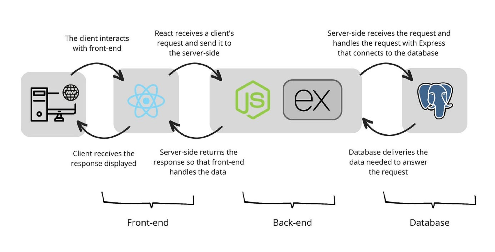

# PennDash – Restaurant Review Website


Demo Video -  https://drive.google.com/file/d/1CA39Xxb1Jif8d1ybGm8vc2RhRBgaQNo_/view?usp=sharing 

# Motivation :
The motivation behind PennDash Project stems from the growing demand for accessible, personalized dining recommendations, as highlighted by recent trends in the restaurant industry. With 94% of diners researching restaurants online before visiting and 79% preferring customized suggestions, there’s a clear need for platforms that provide tailored dining information and intuitive user experiences (Zippia; Restaurant Dive). PennDash meets this need by offering a Pennsylvania-specific platform that allows users to explore and save their favorite dining spots, filter based on key preferences like cuisine, location, and rating, and discover trending restaurants through Yelp’s extensive dataset. The platform’s Google Maps integration ensures easy navigation, while secure login provides a personalized and reliable user experience. By connecting locals and visitors to their ideal dining options, PennDash enhances the way people discover and engage with Pennsylvania’s vibrant culinary scene, offering an impactful, timely solution rooted in real-world demand and industry insights.

# Project Description :
The goal of this project is to develop PennDash, a user-friendly restaurant review platform focusing on the state of Pennsylvania. The website will enable users to explore restaurants based on various filters, such as type of cuisine, location, ratings, or name, and can favorite or bookmark restaurants based on individual preferences. The platform will incorporate key functionalities like: Detailed restaurant reviews and ratings along with their business information (e.g., Wi-Fi availability, outdoor seating, vehicle parking, etc.), location mapping via Google Maps integration, users can save their favorite restaurants or bookmark, and refer them later on, secure login/logout functionality for an optimized user experience, trending restaurant analytics based on Pennsylvania and user feedback trends from Yelp’s public dataset will be shown to the user.

# System Architecture :


Folder structure is as follows -
```
.
├── penndash_app                 # Main application folder
│   ├── node_modules             # Dependencies installed via npm
│   ├── public                   # Static resources
│   │   ├── images               # Images used in the application
│   │       ├── cuisines         # Cuisine-specific images
│   │       ├── default          # Default placeholder images
│   ├── src                      # Source code for the frontend
│   │   ├── components           # UI components grouped by functionality
│   │   │   ├── analytics        # Analytics page components
│   │   │   ├── bookmarks        # Bookmarks management components
│   │   │   ├── favorites        # Favorites management components
│   │   │   ├── home             # Homepage components
│   │   │   ├── loginregister    # Login and registration components
│   │   │   ├── logout           # Logout components
│   │   │   ├── restaurantpage   # Restaurant details page components
│   │   ├── .env                 # Environment variables for the frontend
│   │   ├── App.css              # Global styles for the app
│   │   ├── App.js               # Main React component
│   │   ├── index.css            # Entry-point styles
│   │   ├── index.js             # Entry-point script
│   ├── README.md                # Documentation for the frontend
│   ├── generate-react-cli.json  # Configuration for React CLI
│   ├── package-lock.json        # Dependency tree for the frontend
│   ├── package.json             # Project metadata for the frontend
├── server                       # Backend server
│   ├── __tests__                # Unit tests for the backend
│   │   ├── results.json         # Test results
│   │   ├── tests.js             # Test cases
│   ├── config.json              # Server configuration
│   ├── constants.js             # Backend constants
│   ├── package-lock.json        # Dependency tree for the backend
│   ├── package.json             # Project metadata for the backend
│   ├── routes.js                # API route handlers
│   ├── server.js                # Entry-point script for the backend
├── .gitignore                   # Git ignore file
├── README.md                    # Documentation for the project
├── package-lock.json            # Root dependency tree
├── package.json                 # Root project metadata
```

# Dataset: 
https://www.yelp.com/dataset
